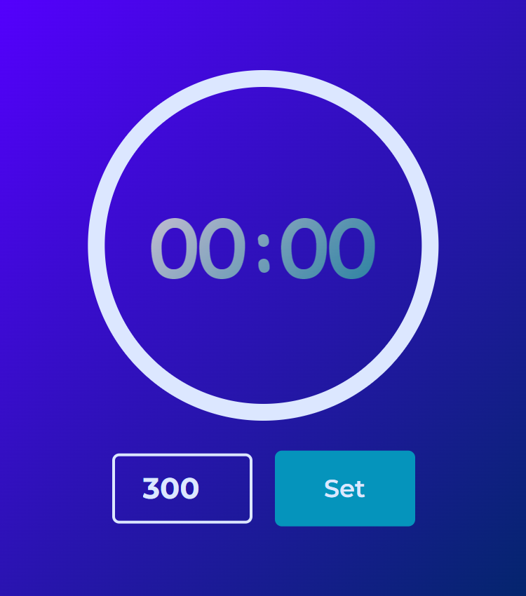
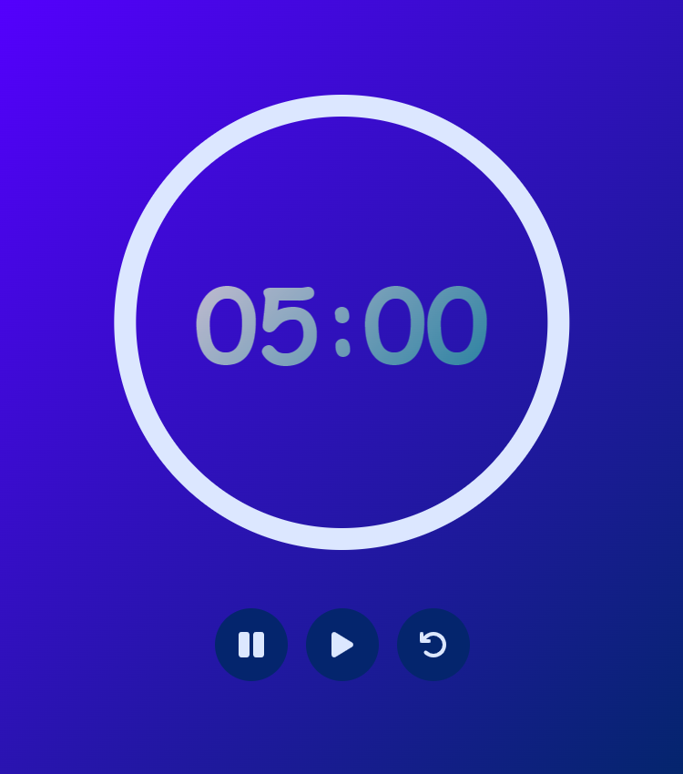

# Countdown Timer

## Introduction

This project is a countdown timer that allows users to set a timer for a specified number of seconds and then start, pause, and reset the countdown. The timer provides a visual and interactive way to track time for various activities.

## Features

### Set Timer

- Users can input the number of seconds for the countdown.

### Start Timer

- Users can start the countdown.

### Pause Timer

- Users can pause the countdown.

### Reset Timer

- Users can reset the countdown to the initial time set.

## User Interface

### Input Fields

- **Time Input**: A text input or number input where users can specify the number of seconds for the countdown.

### Buttons

- **Start**: Starts the countdown.
- **Pause**: Pauses the countdown.
- **Reset**: Resets the countdown to the initial time set.

## Usage

### Setting the Timer

Users can set the timer by entering the desired number of seconds into the input field. This can be done using a text input or number input element.

[Github Repo](https://github.com/Smartlify07/Countdown-timer)
[Vercel Link](https://countdown-timer-crpe.vercel.app/)
